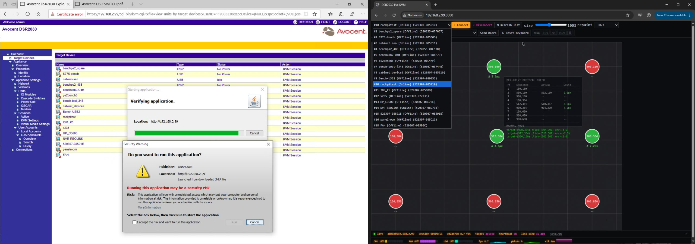
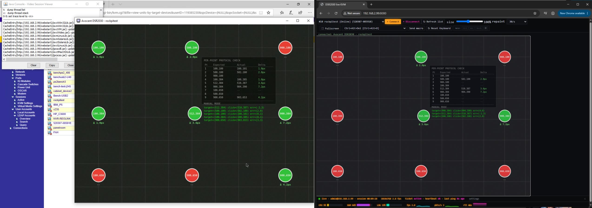
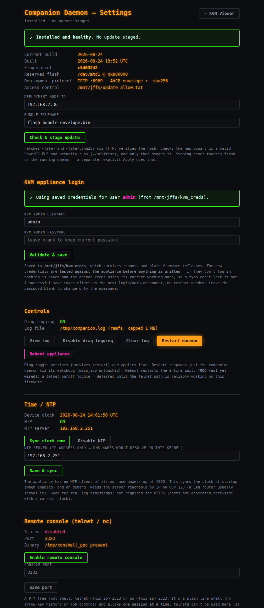

Hope this helps if you're running one of these old KVMs.

Quick disclaimer since this was built with a lot of AI help: if you have a problem with AI-assisted code, you've got three choices — use it as-is, help improve it, or delete it and move on. I'm not a programmer, I'm a jack-of-all-trades with too many projects and three young kids, so "good enough and working excelent for me" is the bar here. Use this at your own risk — I have not gone through it line by line, and it touches KVM firmware, so treat it accordingly. Most of the actual coding was Claude working at my direction. I'll keep adding features as time allows.

**Why**

Flipping `java.security` and re-adding IP exceptions on every PC just to launch a KVM session got old fast. This replaces the Java Web Start client with a native on-device daemon (`avsp_client_ppc`) that just streams to a browser — no local software, no per-machine config, easily viewable on a mobile device (no OSK yet, but maybe in the future). 

This is release-ppcbin: precompiled PowerPC binaries only, no source, no build toolchain. Smaller download, same features as the full source release — just can't rebuild `avsp_client_ppc` from here.

**Requires**: `dsr_x030_3.7.2.8.fl` stock firmware (md5 `E6A1739BE9941F441877057D231C5F9E`), and root shell access on the device (see `--modem-console` / conshell below).

## Quick start

1. **Getting a root shell.** 
First time on a stock unit, you need physical/console access to enable one (out of scope here —  I used a console-injection on the first serial port, however publishing that would likely get this caught up in all sorts of dingleberry fruit). For now the only option you have is to come up with one, or flash the modified firmware this tooling (runme.sh) creates.

So getting started at this junction in time is really having the latest stock firmware file above on the same machine, and running the tooling "runme.sh" to modify it, and flash it back to your KVM to enable other features below. 

Using the tooling to modify the firmware you can build:
- enable the `--modem-console` serial port as a root console 
- enable avsp-onboard (default is port 8080)
- Update java certs

Once you are running the modified firmware you can
- Enable `conshell` for network access ( plaintext sort of telnetd like root console, absolutely zero security)
- Other features available inside settings as well


==> The firmware tool always verifies the stock image's checksums first and refuses to touch anything that doesn't check out clean, and re-verifies its own output the same way.


At this stage, I don't have the actual binary files baked into the firmware image yet. To get them living on the device, you'll need to:
- setup TFTP server (on your PC) ( runme.sh takes care of this using a python tftp server)
- put all the necessary files into that directory (runme.sh does this as well)
- a root shell on the device, via either the modem-port terminal or a `conshell` telnet connection to kick off the install.sh script, which WILL WRITE TO FLASH - YOU'VE BEEN warned.


run `./runme.sh`, pick :
- option 2 to build a modified `.fl` firmware image (pick which features above go into it)
- option 3 to install the avsp_client_ppc ( native browser replacement of the java app), and answer the prompts (device IP, target port, etc). 
Runme.sh builds the bundle + `install.sh` for you, then offers to start a TFTP server itself (`avsp_onboard/mini_tftpd.py`, vendored, no `tftpy`/system `tftpd` needed) — say yes and it prints the exact on-device command to run next and serves until you Ctrl+C to kill it. 

From there you only need to run the on-device step below.
Confirm you have a root shell on the KVM using either the modem serial port (**57600 8-N-1, hardware flow control (RTS/CTS)** -- this is NOT the SETUP port's 9600 baud, they're two different ports/UARTs on this device) or `conshell` enabled and started (only available once a first install is already running -- see above).

```
cd /tmp
tftp -g -r install.sh -l install.sh <your-pc-ip> 6969
sh install.sh
```

note: `install.sh` checks for an already-running daemon first (refuses and tells you the `kill -9` to run if it finds one, rather than spawning a second process on top), then fetches everything else, writes the bundle to the reserved flash region, and starts the companion daemon immediately.

Verify, from your PC:
```
http://<KVM-device-ip>:8080/
```

You should at this stage get a screen similar to the screenshots below:

**Before vs. after** -- the old Java client's launch friction (cert warnings, "Verifying application", "may be a security risk") next to the new browser-native viewer, already connected and streaming:


**Mouse-click accuracy calibration**, same test grid run against both clients side by side:


**The companion daemon's own settings page** (update-from-server, appliance login, `conshell` toggle, NTP, diag logging):



## Undo

No in-place removal. Reflash the original stock `.fl` to undo any firmware feature. To remove just the companion daemon from flash (leave the firmware alone), run `avsp_onboard/uninstall.sh` from a root shell on the device.


Further details of the features the tooling will customize 

### `--modem-console`
Real interactive root shell on the physical MODEM port (`/dev/ttyS1`). No network exposure by itself.

### conshell — network root shell
Real `telnetd` doesn't work on this firmware (`/dev/ptmx` missing). `conshell` is the working replacement: a plain-line, PTY-free root shell, toggled on/off from the companion daemon's settings page (needs `--avsp-onboard` installed and running first). Default port 2323, editable from the same page.
```sh
telnet <device-ip> 2323      # or: nc <device-ip> 2323
```
One session at a time, no arrow-key history or job control. **Unauthenticated root — only enable it on a trusted network**, and turn it off again when you're done.

### `--avsp-onboard`
Adds a boot hook so the companion daemon (`avsp_client_ppc`) starts itself automatically. This flag only touches the firmware image — the daemon binaries themselves are installed separately (step 3 above) into a reserved, otherwise-unused 3MB flash region, so they survive future firmware updates without needing to be in every `.fl`.

Once running, the daemon's own web UI (`http://<device-ip>:8080/settings`) has an **update-from-server** page: point it at a TFTP host + filename and it fetches, verifies, self-tests, and stages a new build over the network — no console session needed for routine updates after the first install. A write-allow whitelist (`/mnt/jffs/update_allow.txt`, one CIDR per line) can restrict who's allowed to push updates; missing file = allow all.

Note: keeping a persistent TFTP server running on your linux PC is handy for development work, as the existing firmware has a magic# integrated into it, when a newer version is available, the settings GUI will permit you to "pull" it automaticlaly and install it. 

### `--java-certs --cert-ip <ip>`
Helps fix the *original* Java Web Start client (expired signing cert, expired/hostname-mismatched HTTPS cert, an MD5-signed video cert Java refuses outright, and a dead TLS cipher list) so it launches again 
Note this is **Java 8 only**, no modern JRE can ever work with it. Generates fresh throwaway certs/keys every run, ~20yr validity. Needs `openssl` and a JDK 8+ (`keytool`/`jarsigner`/`jar`) on `PATH`, or point `--jdk-bin` at one.
From digging ( I am not a Java expert) - No newer Java will work - eg Java 11+/17+/21 at all (appliance has no ECDHE support, those newer Java JDKs removed everything else).


## Layout

```
release-ppcbin/
  runme.sh                   interactive menu -- start here
  build_kvm_firmware.py      main tool (runme.sh calls this)
  avocent_fl_tool.py         .fl container unpack/pack/verify (vendored)
  cramfs_tool.py             cramfs reader/writer (vendored)
  patch_cipher_list.py       Stingray.class cipher patch (vendored)
  features/                  modem_console.py, avsp_onboard_hook.py, java_certs.py
  avsp_onboard/               precompiled binaries + deploy_bundle.py, mini_tftpd.py,
                               uninstall.sh (no C source, no build.sh, no toolchain here)
```

`runme.sh` checks Python/openssl/JDK, then a simple numbered menu: open a firmware file, build modified firmware, build the companion bundle, or re-run the dependency check. Every step shows the exact command before running it and asks you to confirm.


## What's in flash_bundle_envelope.bin ?

Built by `deploy_bundle.py`'s `build_envelope()` in `avsp_onboard/deploy_bundle.py`, in two steps:

Tar up 5 the files below 

| File | What it is |
|---|---|
| `avsp_client_ppc` | the companion daemon binary itself |
| `kmem_patch` | applies the two live kernel-memory patches the video-read path needs |
| `ensure_patched.sh` | wrapper: checks the kernel build matches, applies `kmem_patch`, execs the daemon |
| `watchdog.sh` | supervises the daemon, respawns it on any exit |
| `mtd_erase_write_ppc` | so the daemon's own update-from-server feature can write a future staged bundle to flash without needing anything fetched from your PC again |

2. Wrap the tar in an 8-byte header**: 4 bytes of magic `"AVCB"` + a 4-byte big-endian length, then the tar bytes appended raw. 
For example, a 1,402,880-byte tar becomes `AVCB` + `\x00\x15\x68\x00` (= 1,402,880 in hex) + the tar → 1,402,884 bytes total.

**Why the magic bytes exist**: `mtd_erase_write_ppc` (on-device) reads the first bytes of the target flash region before ever erasing it -- if they're `AVCB`, it knows this is a previous install of our own bundle and it's safe to overwrite; if the region isn't that and isn't blank (`0xFF` throughout), it refuses unless you pass `--force` (so it can't accidentally stomp on something else living in that reserved flash region). `flash_bundle_read_ppc` (the reader, used every boot by `startup.sh`) auto-detects this current "v2" format (`[bytes 0-3: "AVCB" magic][bytes 4-7: length N]`) and a previous format I will remove at a future date once nothing still in the field needs it.

This file is generated fresh every single time you run `deploy_bundle.py` -- it never ships in the repo, and it doesn't depend on the device IP/target-port/etc at all (only `startup.sh`, generated alongside it, is per-device).
